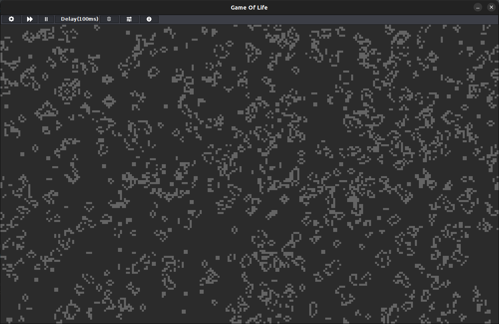
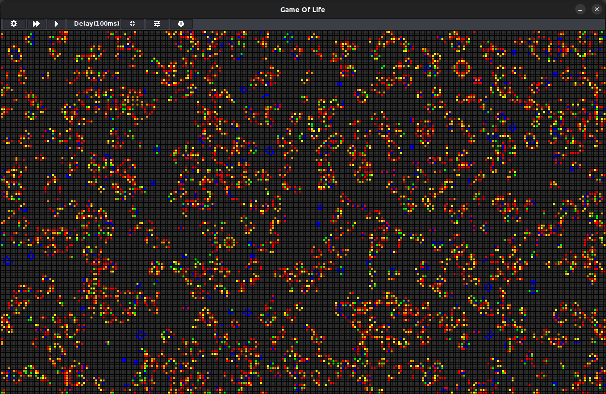
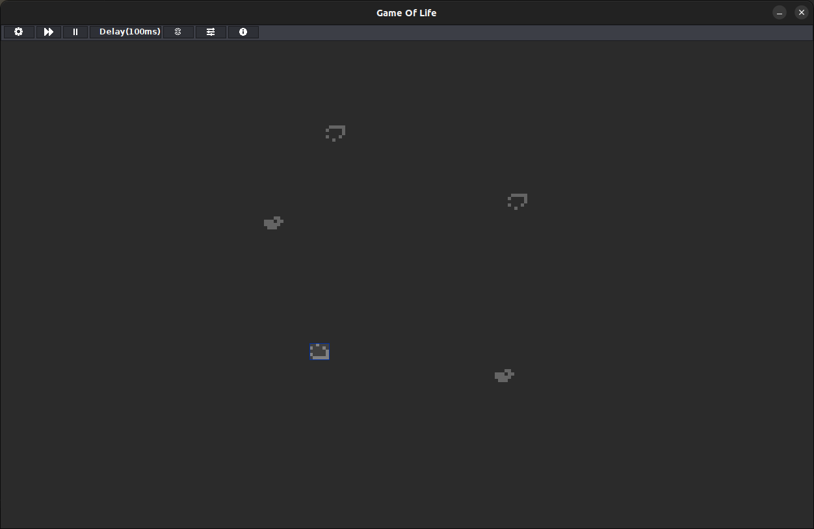

# Game Of Life 
Abitur Informatik Leistungskurs Projekt Januar 2020

## Abstract
As part of the advanced computer science course in high school (Informatik Leistungskurs) we had a project phase in which
we developed various projects. 

The final project was a simulation of Conway's Game of Life.

## Base Requirements
Together in the course we thought about the structure of the cell class in order to practice the concept of having uniform interfaces and being able to exchange them between students.

We were allowed to either create a console or graphical application in Java.

The minimum requirement to pass was a basic simulation of the game.

## My Game of Life
I used java 8 with awt and swing to complete this project.

I also added multiple additional features, listed below.

This allowed me to achieve the highest possible score of 15 points for this project and course.

## Features
Following is a list of all included features
### Settings
- draw-grid: draws a grid above all cells
- toroidal: allows cells to wrap around
- board scale: changes the scale of a single cell (automatically resizes window)
- board size: changes the amount of cells of the simulation (automatically resizes window)
- kill-all: sets every cell to be dead
- rand: randomly assigns each cell to either be alive or dead

### Simulation
- single-step: steps the simulation one generation
- run/pause: pauses or runs the simulation with the set delay
- delay: allows setting the delay between each generation (0ms - 500ms)

### Selection & Patterns
I added a feature to select, save and load patterns to and from a txt files.

Dead cells are saved as "#" and alive cells are saved as ".".

The user can select one pattern which will be drawn as a template on the board. 

Pressing left click will stamp the pattern into the simulation.

- selection tool: allows selecting an area with a mouse
- load pattern: loads a pattern to a txt file
- save pattern: save the selection to a txt file
- current pattern: the currently selected pattern
- presets: different preset patterns (glider & spaceship)

### Filter
Filters allow changing how the cells are displayed.
- tail: dead cells fade into the background
- rainbow: cells display a different color depending on how long they have been alive (red -> blue)

### Info
Displays information throughout the whole simulation.
- generations: the amount of simulated ticks
- alive: how many cells have lived
- revived: how many cells have been revived
- died: how many cells have died

## Build
- Download and unzip.
- cd src
- javac *.java
- java Main
